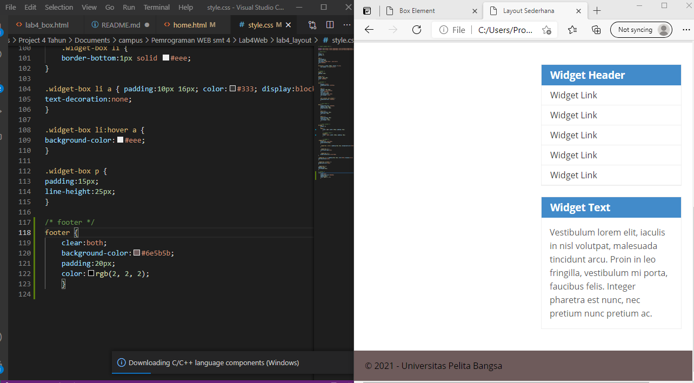

# Lab4Web

## Langkah-langkah Praktikum
Persiapan membuat dokumen HTML dengan nama file lab4_box.html  diikuti dengan Membuat Box Element
Kemudian tambahkan kode untuk membuat box element dengan tag div Selanjutnya tambahkan CSS Float Property deklarasi CSS pada head untuk membuat float element, seperti berikut.

Mengatur Clearfix Element
Clearfix digunakan untuk mengatur element setelah float element. Property clear digunakan untuk mengaturnya.

Tambahkan element div lainnya seteleah div3 Kemudian atur property clear pada CSS seperti berikut.

Membuat Layout Sederhana
Kita akan membuat layout web sederhana 
Buat folder baru dengan nama lab4_layout, kemudian buatlah file baru didalamnya dengan nama
home.html, dan file css dengan nama style.css.

Kemudian tambahkan kode CSS untuk membuat layoutnya.

Membuat Navigasi
Kemudian selanjutnya mengatur navigasi.

Membuat Hero Panel.
Selanjutnya membuat hero panel. Tambahkan kode HTML dan CSS seperti berikut.

Mengatur Layout Main dan Sidebar
Selanjutnya mengatur main content dan sidebar, tambahkan CSS float.

Membuat Sidebar Widget
Kemudian selanjutnya menambahkan element lain dalam sidebar.

Kemudian tambahkan CSS.

maka hasilnya akan seperti ini :

Mengatur Footer
Selanjutnya mengatur tampilan footer. Tambahkan CSS untuk footer.

Menambahkan Elemen lainnya pada Main Content

Kemudian tambahkan CSS.

maka hasilnya akan seperti ini :

Menambahkan Content Artikel
Selanjutnya membuat content artikel. Tambahkan HTML berikut pada main content.

Kemudian tambahkan CSS.

maka hasilnya akan seperti ini :

